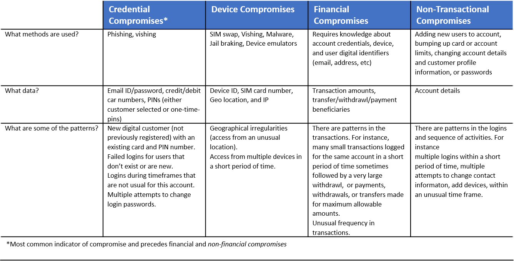
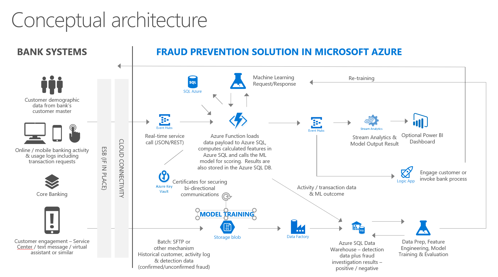
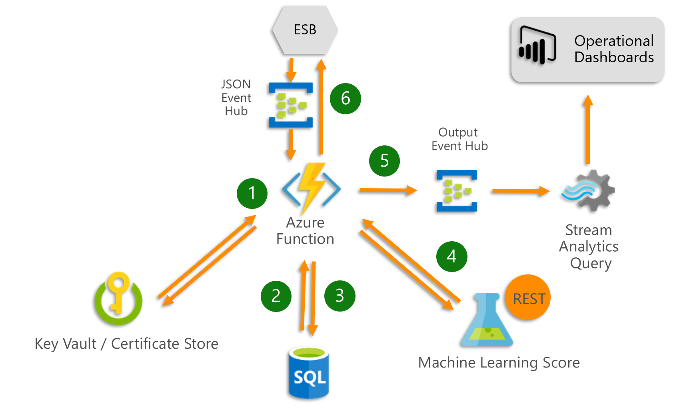
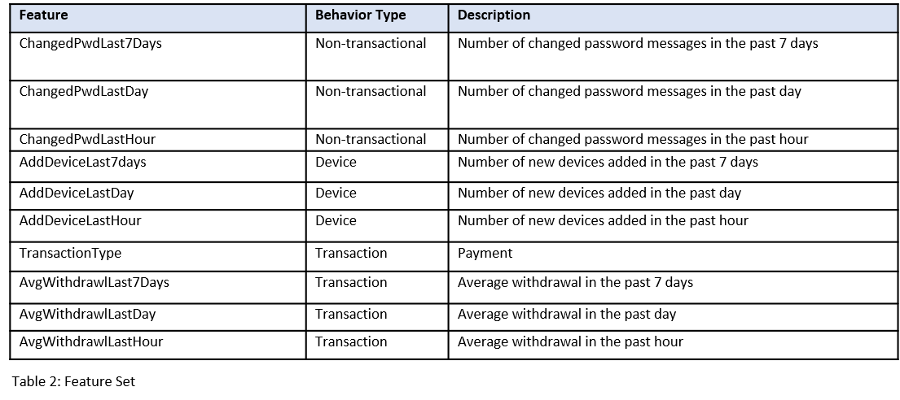
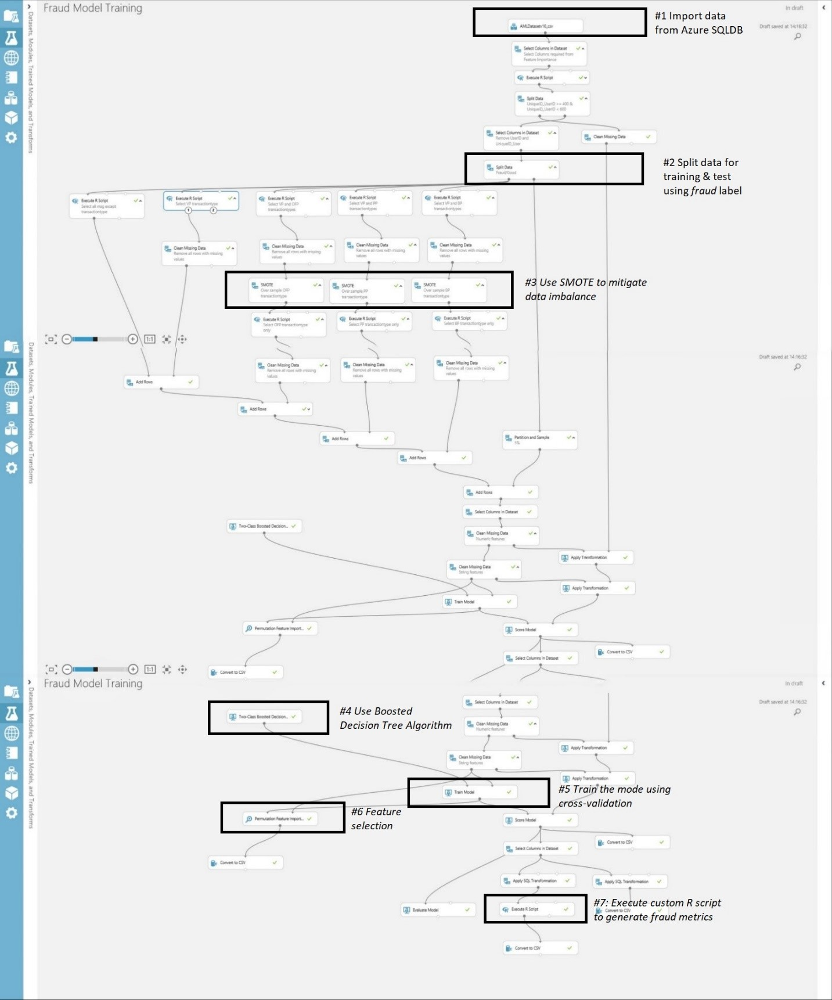
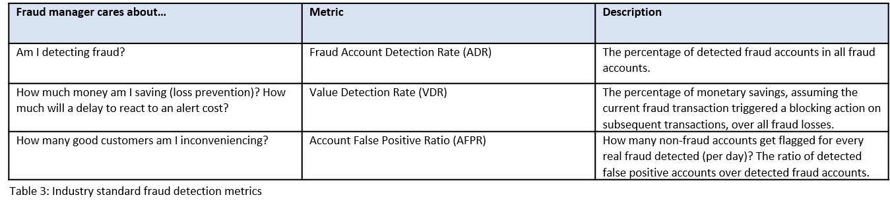
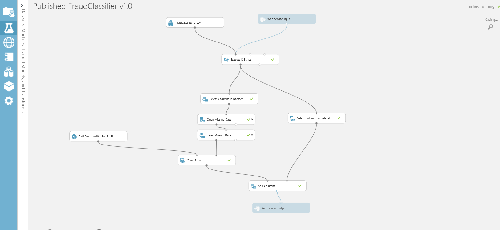
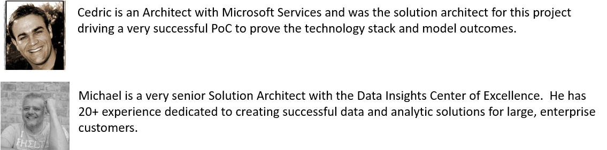

# Mobile bank fraud solution guide
Industry Experiences Team

Have you ever been the victim of online fraud? If so, chances are that a thief made multiple transactions leading to a loss of thousands. That’s why it’s imperative that fraud detection happens in near-real time. With over 800+ million people using mobile apps today, mobile bank fraud is increasing dramatically, and the financial industry is seeing 100% year-over-year increase in losses due to access from mobile platforms. But there is a mitigation: with Azure technology, we’ve created a solution that can predict a fraudulent transaction **within 2 seconds.** This document provides guidance on how to architect a solution in Azure for detecting mobile bank fraud, based on a solution developed for a Microsoft customer in the banking industry. 

## Problem: Needle in a haystack, rigid rules

Most mobile fraud occurs by compromising a device using a technique called [SIM Swap](https://www.theguardian.com/money/2015/sep/26/sim-swap-fraud-mobile-phone-vodafone-customer) in which a mobile number is hacked. The phone number is cloned and the criminal receives all the SMS notifications and calls sent to the victim’s mobile device. Then login credentials are obtained through social engineering, phishing, vishing (using a phone to phish), or an infected downloaded app. With this information, the criminal can impersonate a bank customer, register for mobile access, and immediately start to generate fund transfers and withdrawals. 

Mobile fraud is hard to detect and expensive for consumers and banks. The first challenge is that it is rare. Less than 1% of all transactions are fraudulent which means it can take a lot of time for a fraud or case management team to sift through a pile of potential fraudulent transactions to identify the truly fraudulent ones. A second challenge is that many fraud monitoring solutions today still rely on rule-based engines.  Traditionally, [rule-based engines](https://en.wikipedia.org/wiki/Rule-based_system) have been very effective at detecting established patterns of fraud-like transactions generated from risky IP addresses, or multiple transactions generated within a very short period on a brand-new account. But in today’s criminal environment, rule-based engines have one significant limitation: rules do not adapt quickly to new or evolving types of attacks, and they have the following constraints:

- Detection is not real-time, so fraud is detected only after financial loss occurs.
- Rules are binary and limited; they cannot accommodate the of complexity and combinations of input variables that can be evaluated. This results in high false positives.  
- Rules are hard coded into business logic. Curating the rules, incorporating new data sources, or adding new fraud patterns usually means application changes that impact a business process. Propagating changes throughout a business process can be cumbersome and expensive.

Artificial intellegence (AI) models have the potential to dramatically improve fraud detection rates and detection times, and banks are using them in combination with other approaches to reduce losses.  The approach described here is based on three factors: 

1. an AI model that acts on a derived set of behavioral characteristic
2. a methodology for machine learning
3. a model evaluation process similar to one used by a fraud manager to evaluate his or her portfolio   

## Operational Context
For this bank client, as customers were increasing their use of digital services, there was a spike in fraud across the mobile channel. It was time to re-think their fraud detection and prevention approach.  This solution started and ended with questions that would impact their fraud process and decisions: _Which activities or transactions are likely fraudulent?  Which accounts are compromised? Which activities need further investigation and case management?_  

For a solution to deliver value, there has to be a clear understanding of how mobile bank fraud becomes evident in the operational enviornment:  _What kinds of fraud are perpetrated on the platform? How is it being committed?  What are the patterns in fraudulent activities and transactions?_

The answers to these questions led to an understanding of the type of behavior that could signal fraud.  With the behaviors identified, data attributes were mapped to the messages collected from the mobile application gateways.  Account behavior most relevant for identifying fraud could then be profiled.    

The table below identifies the types of compromise, data attributes that could signal fraud, and behaviors that were relevant for this bank:  

The behavioral dimension is key for detecting mobile fraud. Behavioral based profiles can help establish patterns of typical behavior for an account and the analytics can alert when an activity appears to be out of the norm.  Below are some of the types of behavior that were profiled:      
- How many accounts are associated with this device? 
- How many devices are associated with this account?  And how frequently are they dropped or added?
- How frequently does this device or customer log in? 
- How often does this customer change passwords? 
- What is the average monetary transfer or withdrawl amount from this account?   
- How often are withdrawals made from this account?  

This solution used an approach based on:  

- Feature engineering to create behavioral profiles for customers and accounts 
- Azure machine learning to create a fraud classification model for suspicious or inconsistent account behavior 
- Azure services for real-time event processing and end-to-end workflow 

## High Level Architecture
There are three workstreams in this architecture:  
- An event-driven pipeline that ingests and processes log data, creates and maintains          behavioral account profiles, incorporates a fraud classification model, and produces a predictive score
- A model training workstream that combines on-premises historical fraud data and ingested log data 
- Functionality to integrate to backend business processes

The diagram below illustrates the placement for each of the major technology components. 

The solution integrates with the bank’s on-premises environment using an [Enterprise Service Bus](https://en.wikipedia.org/wiki/Enterprise_service_bus) (ESB) and a performant network connection.

Most steps in the event processing pipeline start with an [Azure Function](https://azure.microsoft.com/en-us/services/functions/?WT.mc_id=ms-docs-kbaroni).  Azure Functions were selected because they are serverless, easily scaled out, and can be scheduled. The primary workload requires processing millions of incoming mobile transactions and assessing them for fraud in near real-time. 

A second workload is batch oriented and used for model training and re-training.  [Azure Data Factory](https://docs.microsoft.com/en-us/azure/data-factory/introduction/?WT.mc_id=ms-docs-kbaroni) orchestrates the processing steps including: 

- Upload of labeled historical fraud data from on-prem sources 
- Archival of data feature sets and score history for all transactions
- Extraction of events and messages into a structured format to be used for feature engineering, model re-training and evaluation, and
- Training and re-training of a fraud model using Azure Machine Learning Studio (AML Studio) 

And finally, the 3rd workstream involves integration to backend business processes.  In the diagram, this is represented with [Azure Logic Apps](https://azure.microsoft.com/en-us/services/logic-apps/?WT.mc_id=ms-docs-kbaro). Logic Apps can be used to connect and synchronize to an on-premises system to take an action like create a fraud management case, suspend account access, or to generate a phone contact. 

Central to this architecture is the data pipeline and AI model, both of which are discussed in more detail below. 

## Data pipeline and automation
Once a criminal has access to a bank account through a mobile app, a financial loss can occur in minutes. Effective detection of fraud activity must occur while the criminal is interacting with the mobile application and before a monetary transaction has occurred. The time it takes to react to a fraudulent transaction directly influences how much financial loss can be prevented. The sooner the detection takes place, the less the financial loss.

Less than two seconds and – ideally - a lot less.  That’s the maximum amount of time between when a mobile banking activity gets forwarded for processing and when it needs to be assessed for fraud.  Two seconds to collect a complex JSON message, authenticate it, parse and transform the JSON, create account features from the data attributes, submit the transaction for a fraud score, and synchronize with a backend case management system. Latency and response times are critical in a fraud detection solution and the infrastructure to support it must be fast and scalable. 

## Event processing
Telemetry data from the bank’s mobile application gateways is formatted as raw JSON files and streamed to Event Hub where an Azure Function is used to orchestrate the processing. The diagram below illustrates the key interactions for an Azure Function within this infrastructure which includes:

1. Collect raw JSON messages from [Azure Event Hubs](https://azure.microsoft.com/en-us/services/event-hubs/?WT.mc_id=ms-docs-kbaroni) and authenticate them using an SSL certificate retrieved from [Azure Key Vault](https://azure.microsoft.com/en-us/services/key-vault/?WT.mc_id=ms-docs-kbaroni)
2. Coordinate the deserialization, parsing, storing, and logging of raw JSON messages using [Azure SQL          Database](https://azure.microsoft.com/en-us/services/sql-database/?WT.mc_id=ms-docs-kbaroni)
3. Create and maintain account profiles by calling a stored procedure in Azure SQL Database
4. Call out to [Azure Machine Learning](https://docs.microsoft.com/en-us/azure/machine-learning/studio/consume-web-services/?WT.mc_id=ms-docs-kbaroni) web services to execute a predictive model and obtain a fraud score  
5. Post the scored results to an internal Event Hub which feeds into an [Azure Stream Analytics](https://azure.microsoft.com/en-us/services/stream-analytics/?WT.mc_id=ms-docs-kbaroni) job that        outputs calculations to a real-time operational analytics dashboard with [PowerBI](https://powerbi.microsoft.com/en-us/?WT.mc_id=ms-docs-kbaroni)
6. Post scored results back to an on-premises system for further fraud management activity 

## JSON Transformation
Data flows in from multiple mobile application gateways as raw JSON files. Each gateway produces the telemetry from a user’s interaction, capturing information like the OS, mobile device meta data, account data, and transaction requests and responses. There’s a lot of variation between the JSON files. And attributes and data types can be disparate and inconsistent.  Another complication with the JSON files is that attributes and data types can change unexpectedly as application updates are pushed out to the gateways and features are removed, modified, or added.  To standardize on a schema for JSON files, some of the data cleaning resolves issues like: 

- A JSON file may include one or more mobile phone interactions; each interaction needs to be extracted as    a separate message
- Fields may be named or represented differently  
- Characters like new lines or carriage returns are embedded inconsistently within messages 
- Attributes like email addresses may be missing or partially formatted
- Complex, nested properties and values 

Each JSON file is parsed and the attributes are extracted and inserted into a database. These attributes are used later to create features for the fraud classifier. The power of data in this solution is because the JSON data can be standardized, joined, and aggregated with historical data to create behavior profiles. 

## Data processing
In this solution, data comes from multiple sources including authentication records, customer information and demographics, transaction records, and log and activity data from mobile devices.  When it comes to preparing data for analytical models, there are multiple options for languages and tools like R and Python.  For this solution, Azure SQL was used to do the data parsing, pre-processing, and featurization because SQL was the skill set most familiar to the bank developers.  The essential capabilities in Azure SQL Database that were used included: 

- [SQL Server JSON Functions](https://docs.microsoft.com/en-us/sql/t-sql/functions/json-functions-transact-sql?view=sql-server-2017/?WT.mc_id=ms-docs-kbaroni) to parse and deserialize the raw JSON messages.  Attributes like transaction type,digital identifier, time-stamps, mobile device attributes are extracted and stored in the database.
- [Memory Optimized Tables](https://docs.microsoft.com/en-us/sql/relational-databases/in-memory-oltp/memory-optimized-tables?view=sql-server-2017/?WT.mc_id=ms-docs-kbaroni) were used to store the account profiles. Memory-optimized tables have advantages over traditional SQL tables because they are created and access in main memory.  The latencies and overhead of disk access are avoided.  This requirement for this solution was to process 300 JSON messages/second and memory optimized tables provided for this level of throughput.  
- Memory-optimized tables are most efficiently accessed from [natively compiled stored procedures](https://docs.microsoft.com/en-us/sql/relational-databases/in-memory-oltp/natively-compiled-stored-procedures?view=sql-server-2017&viewFallbackFrom=sql-server-2017%2F%3FWT.mc_id%3Dms-docs-kbaroni). Unlike interpreted stored procedures, natively compiled stored procedures are compiled when they are first created. 
- [Temporal Tables](https://docs.microsoft.com/en-us/azure/sql-database/sql-database-temporal-tables?WT.mc_id=ms-docs-kbaroni) is a feature that automatically maintains change history in a table.  Whenever a row is added or updated, it is versioned and written to the history table. In this solution, the account profiles were stored in a temporal table, created with a 7-day retention policy so rows were automatically removed when they exceeded the retention period.

## Feature creation
Features are a way to profile account behavior by aggregating activity over different time scales.  They are created from data in the application logs that represent transactional, non-transactional, and device behavior. Transactional behavior includes monetary transaction activities like payments or withdrawals.  Non-transactional behavior includes user actions like login attempts or password changes.  Device behavior includes activities that involve a mobile device like adding or removing a device.  

Features were constructed to represent current and past account behavior including:

- New user registration attempts from a specific device
- Successful/unsuccessful login attempts
- Requests to add 3rd party payees or beneficiaries
- Requests to increase account or credit card limits
- Password changes

An account profile table was created with attributes from the JSON transaction like Message ID, Transaction Type, Payment Amount, day-of-week, hour-of-the-day. Activities were aggregated across multiple timeframes like hour, day, 7-days, and stored as a behavior history for each account.  Each row in the table represented a single account.  Examples of some of the features include:  

Once the account features are calculated and the profile updated, an Azure function makes a call to the machine learning model for scoring via a REST API to answer the question…_What is the probability this account is in a state of fraud based on the behavior we have seen up till now?_

## AI Model
In this solution, an AI model dramatically improved fraud detection rates. Using AML Studio, a fraud classifier was developed with five months of labeled data.  The process to deploy the model is a two-step process:

- Create and train an experiment using a labeled data set
- Convert the trained model to a scoring model and publish it to production

There is one issue common to fraud data sets that needs to be addressed before model development can begin.  

## Data imbalance
Fraud classification is challenging because of the severe class imbalance. In a fraud data set there are many more non-fraud transactions than fraudulent transactions, typically less than 1% of the data set contains fraud transactions. Unless it is addressed, this imbalance between fraud/non-fraud transactions can cause a credibility problem with the model because all transactions could end up classified as non-fraud. This means the model completely misses all the fraud transactions but still achieves a 99% accuracy rate. A highly accurate model that does not detect fraudulent transactions is unacceptable.    

The goal for the data set is to get to a distribution between fraud and non-fraud data that is reasonable and will work with a classifier.  For this solution, the classifier worked well with a data distribution of 95% non-fraud and 5% fraud data.  To redistribute the data and create a better balance between fraud and non-fraud transactions, three techniques were used:

- Under-sampling the non-fraud instances
- Over-sampling the fraud instances with synthetic data generation
- [Stratified sampling](https://https://en.wikipedia.org/wiki/Stratified_sampling) using the fraud label to split the data into training and test sets 

To reduce the number of non-fraud transactions, only 10% of non-fraud transactions were included in the final training data set.

To increase the number of fraud transactions, a technique called [Synthetic Minority Oversampling Technique (SMOTE)](https://docs.microsoft.com/en-us/azure/machine-learning/studio-module-reference/smote/?WT.mc_id=ms-docs-kbaroni) was used.  SMOTE is a statistical technique that uses bootstrapping and k-nearest neighbor (KNN) to produce instances of the minority class.  It is implemented in AML Studio as a module that can be dropped into the model workflow to programmatically increase the number of instances in the data set for the minority class.  

The third technique used to ensure a reasonably balanced data set is also configurable in the model workflow and is implemented during model training.

## Model training
An experiment like the figure below is created in an AML Studio workspace using a drag-and-drop UI to design a workflow that connects data sets to modules. The experiment workflow follows a predictive model process to generate a score as follows:  

1. The input data set is imported from Azure SQL which simplifies the overall workflow process because the     features that will be used in the experiment have already been created,
2. The [Split Data](https://docs.microsoft.com/en-us/azure/machine-learning/studio-module-reference/split-data/?WT.mc_id=ms-docs-kbaronia) module is used to designate 75% of the input data set to be used for model training and 25% to be used for model testing.  Further, the option to use stratified sampling was selected so the data would be partitioned based on the fraud label, 
3. The SMOTE module is included in the workflow and used to increase the number of fraud instances, 
4. Both [Logistic Regression](https://docs.microsoft.com/en-us/azure/machine-learning/studio-module-reference/two-class-logistic-regression/?WT.mc_id=ms-docs-kbaroni) and [Boosted Decision Tree](https://docs.microsoft.com/en-us/azure/machine-learning/studio-module-reference/two-class-boosted-decision-tree/?WT.mc_id=ms-docs-kbaroni) algorithms were evaluated. The Boosted Decision Tree classifier outperformed the Logistic Regression classifier and was selected.
   
5. A technique called [cross-validation](https://en.wikipedia.org/wiki/Cross-validation_(statistics)) was used to validate the model. In cross-validation the training data is portioned into a configurable number of equally sized subsets. The experiment is repeated with each of the subsets used exactly once as validation data for the model. The results are then averaged together across the experiments to provide a consolidated performance estimate. For the training model, 5-fold cross validation was used which meant the data was split into 5 subsets and the experiment was repeated 5 times,
6. Feature selection. When a very large number of features are defined in a data set, it can impact the performance of an algorithm.  To reduce model training time, data set size, and simplify model evaluation, features were examined to determine which features in the data set were most relevant for predicting fraud. The Permutation Feature Importance module in AML Studio was used to compute importance scores for each of the features.  The features that did not contribute to the classification were removed, and  
7. Model evaluation metrics are calculated using a custom module written in R to create fraud-specific metrics. 

The process of model training is a cycle of running and re-running experiments to find and tune an approach that works well to answer the question: _What is the probability this account is in a state of fraud based on the behavior we have seen up till now?_

## Model Evaluation
One of the challenges that makes fraud detection difficult is the difficulty of creating a ‘good’ model; a model that produces realistic and actionable results. Most fraud detection models produce a binary decision to answer the question: Is this a fraudulent transaction (Y/N)?  The decision is based on two factors; (1) a probability score between 0-100 returned by the classification algorithm and, (2) a probability threshold that has been pre-established by the business; above the threshold the transaction is considered fraudulent, below the threshold the transaction is considered non-fraudulent.  While probability is a standard metric for any classification model, it is typically not enough in a fraud scenario for a business to decide to act and block an account to prevent further losses. 

For this solution, account level metrics were created and factored into the decision on whether the business should act and block an account.  The account level metrics were defined based on industry standard metrics described in the table below: 

These metrics are valuable data points for a fraud manager and are used to get a more complete picture of the account risk and make a decision on remediation.  In AML Studio, there is the capability to develop a custom coded module in R or Python and upload it into the experiment.   For this solution a [custom R function](https://docs.microsoft.com/en-us/azure/machine-learning/studio/custom-r-modules/?WT.mc_id=ms-docs-kbaroni) was developed to generate these metrics and plot out the statistics. The function calculates the account level metrics and is available in [this R notebook](https://gist.github.com/jspoelstra/9577c07d3c9d1087072b87051abd3c59).

## Model Operationalization and Retraining
Once the trained model is ready to be deployed as a web service, it is converted to a scoring model within AML Studio and will look like the figure below:

When an experiment is deployed as a web service, the **Import Data** module is disabled, and the **Web service input** module becomes dynamically enabled.  The web service is deployed as a REST API and is callable from multiple programming languages and platforms. It can be consumed in one of two modes:

- Request-Response Service (RRS) is a basic web service interaction that takes a single instance and returns a single prediction,
- Batch Execution Service (BES) is an interaction that accepts multiple instances in a single batch and returns one prediction for each instance

Predictive models need to be updated periodically. Over time and as new and different data becomes available, a predictive model will need to be re-trained to continue to be effective. This is especially true for fraud detection models where new patterns of criminal activity are frequent, requiring a model to be updated to learn the new patterns. It also becomes necessary when the telemetry from mobile application logs change due to modification pushed out to the application gateway. To provide for re-training in this solution, every transaction submitted for analysis and the corresponding model evaluation metrics were logged.  Over time, the model performance was monitored; and when it appeared to degrade, a re-training workflow was triggered. In this solution, several different Azure services were introduced into the re-training workflow:

- Azure SQL Data Warehouse was used to store historical customer data and known fraudulent transactions uploaded from on-premise sources as well as data archived from the AML web service including transactions, predictions, and model evaluation metrics. The data needed for retraining is stored in this database.   
- Azure Data Factory was used to orchestrate the data flow and process for retraining including the extraction of historical data and log files from on-premise systems, the json deserialization process, and data pre-processing logic in Azure SQL Database. A detailed reference for how to use Azure Data Factory for model re-training is available in Retraining and [Updating Azure Machine Learning models with Azure Data Factory.](https://azure.microsoft.com/en-us/blog/retraining-and-updating-azure-machine-learning-models-with-azure-data-factory/?WT.mc_id=ms-docs-kbaroni)

The steps for re-training a predictive model developed with AML Studio are described [here](https://docs.microsoft.com/en-us/azure/machine-learning/studio/retrain-machine-learning-model).

## Technical Considerations
Selecting the right technology components for a 24*7, cloud-based infrastructure for fraud detection depends on understanding current—and sometimes vague—requirements.  The technology choices for this solution were based on considerations that may be helpful to guide similar decisions.  

## Skill Sets
What are the current technology skill sets for the teams designing, implementing, and maintaining the solution?  Cloud and AI technologies expand the choices available for implementing a solution. For this project, the current skill set of the team was an important consideration and had a direct impact on the technology chosen for implementation. For example, the team had strong SQL skills so the decision for Azure SQL was made for data preparation and featurization.  Another decision influenced by team skills was the decision to use Event Hubs. Event Hubs is a managed service that is easy to set up and maintain. And while there were technical advantages for an alternative decision using Kafka, it would have required an investment in re-training.

## Hybrid Operational Environment
The deployment for this solution spanned the bank’s on-premises environment and the Azure environment. Services,networks, applications, and communication had to work effectively across both infrastructures to support the workload.  The technology decisions included:

- How will the environments be integrated?  
- What is required for network connectivity between the Azure datacenter and the bank’s on-premises infrastructure? A decision was made to adopt [ExpressRoute](https://azure.microsoft.com/en-us/services/expressroute/?WT.mc_id=ms-docs-kbaroni) because it provided for dual lines, redundancy, and failover. Site-to-site VPN did not provide the security or Quality-of-Service (QoS) needed for the workload.  
- How will fraud detection scores integrate with the bank’s backend systems? Scoring responses should integrate with backend fraud workflows to automate verification of transactions with customers or other case management activities. Integration from Azure services to the on-premises bank systems can be done     with either Azure Functions or Logic Apps.

## Schema Management
How can schema management be automated?    JSON is a very flexible and portable file format and one of the reasons for this is that a schema is not stored with the data.  The challenge comes when JSON files need to be parsed, deserialized, and processed.  A schema must be coded somewhere that represents the structure of the JSON and can be used to validate the data properties and datatypes. If the schema is not synchronized with the incoming JSON message, JSON validation fails and data is not extracted. This can become a problem when the structure of the JSON message changes because of new application functionality. In this solution, the bank deployed to multiple application gateways, each with their own UI, functionality, telemetry, and JSON message structure.   When the schema was out-of-sync with the incoming JSON data, the inconsistencies created data loss and processing delays for fraud detection.

Consider implementing a dynamic mapping layer between the JSON file structure and the schema that is flexible, responsive, and can be integrated into a Devops process.   One way to do this is to define and maintain the JSON schema as a table in SQL.  Another option could be to maintain the schema on-premise through a pipeline workflow technology like BizTalk.

## Security
What are the security policies and requirements?  Cloud computing introduces new security responsibilities.

- How does security shift with a cloud approach?  The responsibility for security shifts from a traditional   IT approach to a [shared responsibility paradigm](https://blogs.msdn.microsoft.com/azuresecurity/2016/04/18/what-does-shared-responsibility-in-the-cloud-mean/). 
- Can data be encrypted at transit and at rest? Encryption can significantly reduce risk of data loss. In this solution, all connections to Azure SQL Database/SQL Data Warehouse require encryption (SSL/TLS) while data is ‘in transit’ to and from the database. Data is also encrypted at-rest by default. In addition, dynamic data masking was enabled for fields like account and card numbers. 
- How will access to services be controlled?  In Azure, there is a concept of [service principal](https://docs.microsoft.com/en-us/azure/active-directory/develop/app-objects-and-service-principals/?WT.mc_id=ms-docs-kbaroni). It is created in Azure Active Directory and used to authenticate to every PaaS service, and is the security context under which the services run. 
- How will data in Event Hubs be secured?  In Event Hubs there is an [authentication and security model](https://docs.microsoft.com/en-us/azure/event-hubs/event-hubs-authentication-and-security-model-overview) based on a combination of Shared Access Signature (SAS) tokens and event publishers. 
- How will keys and application secrets be secured? Azure Key Vault is a secure container for storing        secrets, certificates, and other secured application data like database strings, REST endpoint URLs, and    API keys. 
- How are database service endpoints secured? Access to Azure SQL Database and Azure SQL Data Warehouse     can be [locked down through firewall rules](https://docs.microsoft.com/en-us/azure/sql-database/sql-database-firewall-configure) or [isolated to VNET](https://azure.microsoft.com/en-us/blog/azure-sql-database-vnet-service-endpoints-now-in-public-preview/)(s).
- How can security be built into the DevOps process?  Security should be built into a DevOps process to establish a baseline for cloud apps. A [Secure DevOps Kit for Azure](https://github.com/azsk/DevOpsKit-docs) is available for download from github    that includes a set of templates, plug-ins, and other tools. 

## Scalability
Will the solution perform end-to-end through peak times? A streaming analytics workflow to handle millions of continuously arriving events demands incredible throughput. Plan to build a test system that can simulate the volume and concurrency to ensure the technology components are configured and tuned to meet the required latencies.  Scalability testing was especially important for these components:

- Data ingestion to handle concurrent data streams. In this architecture, Event Hub was selected because multiple versions of it could be deployed and assigned to different consumer groups. A scale-out approach turned out to be a better option because scaling-up could cause locking. The scale-out approach also was a better fit with plans to expand fraud detection from mobile banking to include the internet banking channel.  
- A framework to manage and schedule the process flow.  Azure Functions were used to orchestrate the workflow.  With this scenario, the best throughput was found when messages where batched up and processed through a single azure function rather than a configuration set up to process 1 message per function call.
- A low-latency data process to handle parsing, pre-processing, aggregations, and storage.  In this solution, the capabilities of in-memory optimized SQL functions met the scalability and concurrency requirements.  
- Model scoring to handle concurrent requests. With Azure Machine Learning Web Services there are two options for scaling; (1) select a production web tier to support the API concurrency workload, or (2) add multiple endpoints to a web service if there is a requirement to support more than 200 concurrent requests. 

## Technologies Presented
The glossary is an index of terms, patterns, and technologies used in the article and relating to the scenario.

- [Azure Data Factory](https://docs.microsoft.com/en-us/azure/data-factory/?WT.mc_id=ms-docs-kbaroni) 
- [Azure Event Hub](https://azure.microsoft.com/en-us/services/event-hubs/?WT.mc_id=ms-docs-kbaroni)
- [Azure Functions](https://azure.microsoft.com/en-us/services/functions/?WT.mc_id=ms-docs-kbaroni)
- [Azure Key Vault](https://docs.microsoft.com/en-us/azure/key-vault/?WT.mc_id=ms-docs-kbaroni)  
- [Azure Logic Apps](https://azure.microsoft.com/en-us/services/logic-apps/?WT.mc_id=ms-docs-kbaroni)
- [Azure Machine Learning Studio](https://studio.azureml.net/?WT.mc_id=ms-docs-kbaroni)
- [Azure SQL Database](https://azure.microsoft.com/en-us/services/sql-database/?WT.mc_id=ms-docs-kbaroni)
- [Azure SQL Data Warehouse](https://docs.microsoft.com/en-us/azure/sql-data-warehouse/sql-data-warehouse-overview-what-is/?WT.mc_id=ms-docs-kbaroni)
- [Azure Stream Analytics](https://azure.microsoft.com/en-us/services/stream-analytics/?WT.mc_id=ms-docs-kbaroni)
- [Power BI](https://powerbi.microsoft.com/en-us/?WT.mc_id=ms-docs-kbaroni)

## Next Steps
Fraud can have a significant impact across many types of businesses and organizations. Like other fraud scenarios, mobile bank fraud can be difficult to detect and may go unnoticed until funds have been illegally removed from an account. To tackle the challenges of rapidly increasing fraud, banks are using a combination of approaches and technology solutions to build their defense. Some of the concepts and technologies discussed here may apply to scenarios like credit card fraud or other types of mobile phone fraud.  

Want to transition to cloud based fraud detection?  Here are some Azure resources to help: 

### Tutorials
- [Online Fraud Detection](https://gallery.azure.ai/Experiment/8e9fe4e03b8b4c65b9ca947c72b8e463) steps through how to build an online transaction fraud solution using Azure Machine Learning Studio
- [Tutorial: Get started using Azure Stream Analytics: Real-time Fraud Detection](https://docs.microsoft.com/en-us/azure/stream-analytics/stream-analytics-real-time-fraud-detection/?WT.mc_id=ms-docs-kbaroni)

### Videos
- [Fraud Detection for a Mobile Banking App using Cortana Intelligence Suite](https://channel9.msdn.com/Events/Build/2017/T6984) 
- [Memory Optimized Temporary Data Structures](https://channel9.msdn.com/Shows/Data-Exposed/Memory-Optimizing-Temporary-Data-Structures)

### Reference
- [Using Azure Data Lake and R for Fraud Detection](https://blogs.technet.microsoft.com/machinelearning/2017/06/28/using-azure-data-lake-and-r-for-fraud-detection/)
- [Online Fraud Detection Template with SQL Server R Services](https://gallery.azure.ai/Tutorial/Online-Fraud-Detection-Template-with-SQL-Server-R-Services-1)
- [Real-time fraud detection on Azure](https://docs.microsoft.com/en-us/azure/architecture/example-scenario/data/fraud-detection/?WT.mc_id=ms-docs-kbaroni)

Special thanks to _Cedric Labuschagne_ and _Michael Hlobil_ for their collaboration on this solution guide, it would not have happened without many helpful hours of collaboration.  

