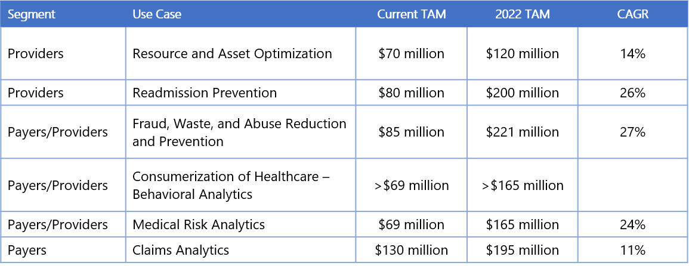
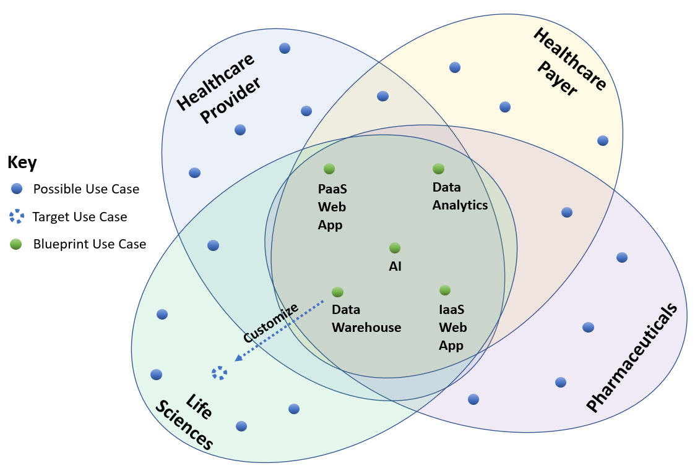
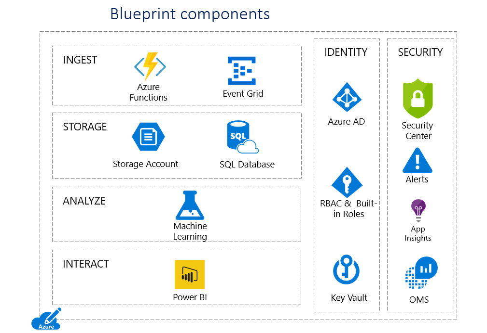
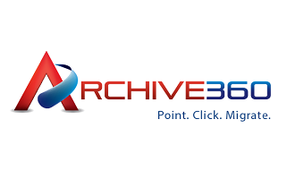
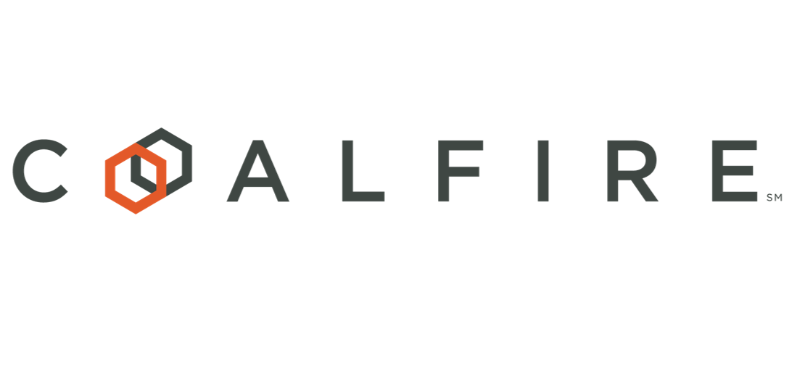

# Artificial Intelligence in Healthcare

_David Houlding, Principal Healthcare Lead, Microsoft Azure
Prepared in collaboration with David Starr, Principal Solutions Architect – Healthcare, and the Industry Experiences Team at Microsoft Azure. Analytics in this report were prepared in collaboration with the AzureCAT Team at Microsoft_.

## Introduction

Healthcare is drowning in data. An article by CIO.com outlines [How CIOs Can Prepare for Healthcare ‘Data Tsunami’](https://www.cio.com/article/2860072/healthcare/how-cios-can-prepare-for-healthcare-data-tsunami.html). Digitization of healthcare information, EHR systems, precision and personalized medicine, health information exchange, consumer health, IoMT (Internet of Medical Things), and other major trends affecting healthcare are accelerating this data growth rate. AI (Artificial Intelligence) and ML (Machine Learning) are powerful tools that empower healthcare organizations to process the tsunami of healthcare data in near real time, maximize the value of this data, and deliver near real time insights that in turn enable healthcare to maximize the Quadruple Aim Objectives. Increasingly healthcare organizations run AI/ML workloads in the cloud to reduce costs, and improve security, agility, and scalability. 

[Clinician burnout](https://https://www.medscape.com/slideshow/2018-lifestyle-burnout-depression-6009235) is a major concern across healthcare providers with 42% of physicians indicating burnout in a recent research study by Medscape, and their job is the major lifestyle factor, with too many bureaucratic tasks (for example charting, paperwork) cited as the major task factor. Too much healthcare data and administrative tasks around the processing of this data exacerbates these challenges. AI/ML can automate the processing of healthcare data and associated mundane tasks, in near real time, freeing up healthcare workers, empowering them with actionable insights, and enabling them to spend more time with patients.

Healthcare costs are skyrocketing. In 2016, <u>healthcare costs in the US are estimated</u> at nearly 18 percent of the GDP! Healthcare is becoming less affordable worldwide, and a serious chasm is widening between those that can afford healthcare and those that cannot. Cloud computing empowers healthcare with strategic, transformative new capabilities while enabling healthcare organizations to reduce costs.

Healthcare is struggling with cybersecurity as evidenced by frequent, large, high profile breaches and ransomware incidents. Cloud computing provides healthcare advanced tools and safeguards they can use to efficiently manage privacy and security, and achieve compliance with applicable regulations, security standards,and data protection laws.

This overview introduces AI in healthcare. It has two parts. The first is a high-level overview of the business values and use cases accelerating the adoption of AI in healthcare, and realization of the associated benefits. The second is an overview of the solution and deployment options. We showcase Microsoft partners specializing in AI, along with healthcare organization references. Finally, we draw several key conclusions regarding the value and practical application of AI in healthcare organizations, and the strategic transformative potential of this technology for the industry worldwide.

## Business value and use cases for AI in healthcare

AI and ML are needed in healthcare to process and maximize the Quadruple Aims benefits of massive and accelerating healthcare data streams. Healthcare—across providers, payers, pharmaceuticals, and life sciences segments—needs to fulfill the [Quadruple Aim Objectives](https://www.ncbi.nlm.nih.gov/pmc/articles/PMC4226781/), which are:

1.	Improving population health and patient outcomes
2.	Reducing healthcare costs
3.	Improving the patient experience, and patient engagement
4.	Improving the healthcare worker experience, and reducing provider burnout

According to Gartner, the healthcare industry investment in data science platforms, including AI (Artificial Intelligence) is growing at approximately 3 times the rate of general investment in software. At 23.1%, Gartner calculates that the healthcare industry has one of the highest growth rates (CAGR) through 2022 for technology investment in data science technologies among all tracked industries. Spending in 2017 on data science technologies (including data warehouses, analytics, and AI/ML services) was $245.8 million; the anticipated total for 2018 is nearly $300 million; and, this is expected to grow to ~$700 million by 2022&#185;.  The growth of investment in data science technologies by healthcare companies is significant when placed against the context of the overall growth rate (at 6.6%) for healthcare provider IT spending on software in general for the same timeframe: from a 2018 basis of ~$20 billion, growing to $24.7 billion by 2022&#178;.  In addition, the overall CAGRs for IT spending on software in general by healthcare payers (insurance) as well as life science companies for the same timeframe are both projected to be ~8.0%. Each segment has a calculated 2018 basis of ~$8 billion, with each growing to ~$11 billion by 2022&#179;.

Several leading use cases have emerged based on customer success stories on AI/ML and healthcare as well as use cases and forecasts by Gartner and other market research firms. Use cases are summarized in the chart below, and then detailed in the sections following the chart. Some use cases include data on the market opportunity and growth; in other cases, proxy information is included, where possible, in the description.

Resource and asset optimization
Hospitals, clinics, and other providers can leverage data to better manage the use and maintenance of clinical and operational resources, including electronic medical devices. Through analytics, machine learning, and IoT, organizations can optimize the use of assets by matching them with demand patterns. For example, by collecting and analyzing multiple sensor data from a medical device and combining it with usage data, a system can predict when a device requires maintenance. This use case includes a higher requirement for non-automated data preparation than other healthcare use cases.

The 2018 TAM for this use case is ~$70 million, expected to grow to ~$120 million by 2022, a CAGR of ~14%&#8308;

## Readmission prevention
Hospitals are seeking to reduce readmits by leveraging data from medical devices, clinical records, and other real-time data sources. Health payers and providers leverage analytics/ML/AI to identify patients who are at risk of being readmitted to the hospital after an initial discharge (for example, within 30, 60 and 90 days). According to Gartner, readmission prevention is the top use case that is unique to the industry, the highest priority area for health care providers. They expect that all accountable-care organizations will invest in these types of systems.

The 2018 TAM for this use case is ~$80 million, expected to grow to ~$200 million by 2022, a CAGR of ~26%&#8309;

## Fraud, waste, and abuse reduction and prevention

Healthcare fraud costs payers and government agencies (e.g., Medicare & Medicaid Services) at least $80 billion in annual losses in the U.S. alone; some estimates are more than double that amount; fraud represents 3% to 10% of total annual spending on healthcare&#8310;.  The potential datasets include billions of records with hundreds of attributes; advanced analytics, machine learning, and real-time monitoring are necessary elements of any solution&#8311;.  Common areas of fraud include over billing, repeated billings, fake prescriptions, repeated procedures, unnecessary or questionable lab tests, errors of medical coding, fictitious claims, and so on. Fraud is a major problem for providers, payers, and integrated payer-provider networks. Gartner anticipates that seventy percent of large healthcare enterprises will invest in fraud reduction solutions in the next five years.

The 2018 TAM for this use case is ~$85 million, expected to grow to ~$221 million by 2022, a CAGR of 27%.&#8312;.

## Consumerization of healthcare—behavioral analytics

Healthcare payers are ahead of providers in understanding the need to accurately profile healthcare consumer behaviors and target meaningful engagement to the right people at the right time—ensuring consumers stay as healthy as possible. The goal is to become more service-oriented, more consumer-oriented in healthcare, so a large payer combines claims data, clinical data, electronic health records, lab results, and other datasets (including patient-generated data from its website and call-center conversations, captured using natural language processing and speech analytics) into a single integrated data warehouse. Through machine learning algorithms, a payer creates a personal member profile that includes medical risks, etc. Analysts then identify specific characteristics and potential traits such as the risk for unnecessary emergency room visits or how well members are controlling their diabetes. These signals are shared with healthcare providers in the payer network.

“Behavioral analytics aren’t just useful for engaging members and keeping patient care costs low,” said Patrick McIntyre, SVP of Health Care Analytics at Anthem. “They can also significantly reduce the time, effort, and frustration of processing claims from providers.” &#8313;

A discrete TAM/CAGR for this use case is a subject of further research; however, as this seems a broader case that might include medical risk analytics, the TAM and CAGR for that use case could be considered a baseline.

## Medical risk analytics

This use case involves data, analytics, and machine learning/AI to predict or assess the risk of various medical needs associated with a specific disease condition. This type of analysis is interesting to both providers and payers (especially the Medicare Advantage Plans) and risk-bearing providers/accountable-care organizations. This is similar to the behavioral analytics use case—might even be considered a subset of the larger use case pattern.

The 2018 TAM for this uses case is ~$69 million, expected to grow to ~$165 million by 2022, a CAGR of 24%.&#8314;

## Claims analytics

Specific to health insurance companies, claims analytics is the use of business intelligence and reporting solutions, dashboards, and data mining and predictive modeling technologies to improve, manage, and analyze claims data and performance. Overall, three components make up claims analytics: claims analysis, reporting, and predictive modeling. As such, the TAM for this use case includes more than strict data science platform, machine learning, and artificial intelligence technologies, but the focus of ongoing investment is ML/AI.

The 2018 TAM for this use case is ~$130 million, expected to grow to ~$195 million by 2022, a CAGR of 11%.&#8315;

## AI in healthcare—solution overview

<u><bold>How does AI/ML work?</bold></u>

The high level process used by AI/ML is as follows:

1.	**Ingest** – import raw healthcare data into the AI/ML environment in the cloud for processing
2.	**Store** – clean and securely store healthcare data in the cloud
3.	**Analyze** – run AI/ML inference on raw healthcare data to yield insights
4.	**Interact** – healthcare workers interact with AI/ML insights and healthcare data to draw conclusions and leverage results

Chronologically, raw healthcare data is ingested and used to train AI/ML models which are then used to analyze (run inference) on raw healthcare data to yield insights which healthcare workers can then interact with to gain new insights into the healthcare data and how best to treat patients. 

<u><bold>Why Microsoft?</bold></u>

Microsoft Azure cloud offers healthcare an alternative for deployment of AI/ML that helps reduce costs, and provides improved security, agility, and scalability. AI/ML can be efficiently deployed in the Microsoft Azure cloud, and multiple [blueprints](https://docs.microsoft.com/en-us/azure/security/blueprints/azure-health?WT.mc_id=aiucovvu-acom-dahouldi) are available to help healthcare organizations accelerate the adoption of AI/ML in the Microsoft Azure cloud. Healthcare organizations can download, configure, run, and customize these blueprints to bootstrap their own healthcare AI/ML initiatives. 

To rapidly acquire new capabilities and implement new healthcare solutions, healthcare IT and developers can now take advantage of industry-specific **solution blueprints** created by Microsoft and partners. A blueprint is comprised of a package that includes documentation, executable code, and sample data built around a key use case of interest to healthcare. Blueprints also contain components to expedite privacy, security, and compliance initiatives. The components include:

- threat models
- security controls
- responsibilities matrices
- compliance audit reports
- … and other related tools.

A blueprint is not just documentation or a how-to guide. It also includes real, executable code and sample test data. With this package, a healthcare IT team can get a new type of solution up and running in their secure Azure cloud quickly. If this were a documentation-only package, any initiative would start from zero; developers would have to implement 100% of the solution. With a blueprint, they get 50%-90% of their end solution. They can concentrate on filling just the remaining 10-50%, with customization of the blueprint solution. The key is to minimize the gap between the blueprint you pick and your target use case as shown in the diagram below:

The steps to developing a customized solution from a blueprint are:

1.	Pick the general blueprint closest to your target use case.
2.	Update the architecture if needed. Typically, the architecture for your target use case will remain the same, or very similar, to the blueprint you pick.
3.	Customize the solution installed using the blueprint to your target use case, including updating documentation.
4.	Switch the test data to your data.
5.	Change any components as needed, for example, if you need a different database.
6.	Blueprints may provide baseline privacy, security, and compliance support. Depending on your applicable regulations and data protection laws, as well as your specific privacy and security requirements, you may need to update privacy, security, and compliance for the solution installed from the blueprint to your requirements.
7.	Implement any other changes required to meet your business and technical requirements.

Microsoft Azure is well positioned vs competitors to realize this capability for healthcare due to:

1.	**Extensive Microsoft Healthcare Team**: thousands of Microsoft employees worldwide with extensive, deep healthcare domain expertise, including doctors and nurses on staff. This team is already familiar with healthcare challenges, strategies, language, and with strong relationships across healthcare providers, payers, pharmaceuticals, life sciences, and business associates / data processors.
2.	**Microsoft Azure Hybrid Cloud**: advanced hybrid solution that provides healthcare a flexible platform to adopt cloud on their terms. There are potential connectivity issues, for example in rural care, where Azure Stack on-prem deployment may be warranted. IoMT edge aggregation use cases may also warrant the use of a local Azure Stack instance. Last, but not least, regulatory or data protection law compliance requirements may make Azure Stack more suitable for some organizations and use cases than Azure cloud.
3.	**Advanced AI/ML Solutions for Healthcare**: 5+ blueprints healthcare organizations can download, configure, run, and customize to accelerate the implementation with AI/ML in Azure, and the realization of the associated benefits.

<u>**Technologies involved**</u>

Key regulations, standards, and technologies used in AI/ML running in the Microsoft Azure cloud:

Technologies Involved

Key regulations, standards, and technologies used in AI/ML running in the Microsoft Azure cloud:
1.	Security and Compliance: HIPAA, HITRUST, Azure AD, Azure Key Vault, Azure Security Center
2.	Interoperability: FHIR (Fast Healthcare Interoperability Resources)
3.	Data Ingestion: Blob Storage and Event Grid
4.	Storage: SQL Database
5.	AI/ML: Azure Machine Learning
6.	Business Intelligence: Power BI (Business Intelligence)
7.	Operations: Azure OMS (Operations Management Suite)

<u><b>Resources required</b></u>

Key high-level resources required for healthcare organizations to leverage AI/ML in the cloud include:

1.	Microsoft Azure Cloud - environment to deploy AI/ML
2.	Technical Resources - capable of managing data flows and configuring cloud environments
3.	Clinical Resources - to interact with AI/ML results and leverage results

<u><b>Deployment options</b></u>

Healthcare organizations use the cloud to get up and running quickly with AI and ML, improve agility and scalability, and address these capabilities as an operational expense, avoiding the need to procure and maintain expensive hardware and the associate IT and cybersecurity resources. When deploying AI and ML to the Azure cloud there are two high-level options:

1.	Build your own
This option gives the healthcare organization more control. However, it requires the healthcare organization to have a team of experienced IT professionals savvy with building and operating AI and ML infrastructure.

2.	Use a partner
This option enables the healthcare organization to focus more on healthcare and the use case and application layer of AI and ML rather than infrastructure. It can also accelerate realization of the benefits of AI/ML since the partner solution gives healthcare organizations a head-start when compared to building this capability from the infrastructure layer.

After scoping requirements for an AI/ML initiative it is recommended that healthcare organizations survey available partner solutions to see what they can leverage to expedite their onboarding of these capabilities and realization of the associated healthcare benefits. Different partners may offer solutions that help with parts of the AI/ML scope, so it may also be beneficial for a healthcare organization to engage multiple partners to help with different aspects of their AI/ML initiative. Partner solutions and services may include: PaaS AI/ML solutions, consulting services, privacy / cybersecurity / compliance services, or other. Wherever possible, for either a build-your-own, or partner deployment option the [blueprints](https://docs.microsoft.com/en-us/azure/security/blueprints/azure-health?WT.mc_id=aiucovvu-acom-dahouldi) discussed in this overview can be used to accelerate AI initiatives.

<u><b>Partner showcase</b></u>

Below are some of the key partners, listed in alphabetical order, that are collaborating with Microsoft on accelerating AI in healthcare.

  

[Archive 360](https://www.archive360.com/)  
Archive360 is the world’s leader in intelligent information management. Its proven platform enables organizations of any size to drive down the cost, risk and uncertainty of digital transformation to the cloud. Archive360 delivers on its customers’ need for non-proprietary information management that ensures security-focused infrastructure independence. Archive360 is a global organization that delivers its solutions both directly and through a worldwide network of partners. Archive360 is a Microsoft Cloud Solution Provider and the Archive2Azure(TM) solution is Microsoft Azure Certified. Archive360 is a partner on the [Azure Security and Compliance Blueprint - HIPAA/HITRUST Health Data and AI](https://docs.microsoft.com/en-us/azure/security/blueprints/azure-health?WT.mc_id=aiucovvu-acom-dahouldi).     See [quote from CTO](https://azure.microsoft.com/en-us/blog/microsoft-releases-automation-for-hipaa-hitrust-compliance/).

<u>Archive360 on AppSource:</u> https://appsource.microsoft.com/en-us/product/web-apps/archive360.43004c92-f54a-4029-9ae9-2aa99ebf913b?tab=Overview

[Avyon Consulting Services](http://www.avyanconsulting.com/)  
Organizations and Government agencies leveraging Azure cloud platform are trying to grasp the complexity associated with cloud. They are stressed about governance and compliance of extraordinarily complex systems and the demand for protections against cybersecurity attacks. Avyan Corp (both its consulting arm and its ISV business unit, [Cloudneeti](https://www.cloudneeti.com/)), are dedicated to enabling customers for an easy, effective and efficient transformation to automated security and compliance monitoring of Azure and Office 365 workloads, thereby providing safe, secure and compliant usage of Cloud Computing technologies. Avyan Consulting Services have a strong healthcare consulting practice and directly collaborated with Microsoft on creating the [Azure Security and Compliance Blueprint - HIPAA/HITRUST Health Data and AI](https://docs.microsoft.com/en-us/azure/security/blueprints/azure-health?WT.mc_id=aiucovvu-acom-dahouldi)  solution.  

 http://www.avyanconsulting.com/azureservices   
 http://aka.ms/Cloudneeti on Azure Marketplace.

  

[CGI ProperPay – AI to Help Mitigate Fraud, Waste, Abuse ](https://www.cgi.com/en/solutions/properpay)  
Serving clients from hundreds of locations worldwide, CGI is a leading IT and business 
consulting services firm focused on being a partner, employer and investment of choice. 
CGI has been a leader in healthcare claims auditing and recovery since 1990. Our CGI ProperPay solution and services for reducing claims fraud, waste and abuse (FWA) have helped Medicare, Medicaid and commercial payers recover more than $2.8 billion in lost payments due to improper claims. We also offer anti-fraud solutions to help detect, remedy and prevent claims fraud, pre- and post-payment. The CGI ProperPay solution makes use of AI/ML (Machine Learning) running in Microsoft Azure.
CGI ProperPay on AppSource: https://appsource.microsoft.com/en-us/product/web-apps/cgi.d9827e75-9119-45ef-a505-67deec14db48https://docs.microsoft.com/en-us/azure/security/blueprints/azure-health 

  
  
[Coalfire – Independent Cyber Risk Management Advisors ](https://www.coalfire.com/)  
As the assessor for the world’s largest cloud service providers, healthcare organizations rely on Coalfire for our deep understanding of cloud technologies and ability to help them navigate cybersecurity needs and meet compliance requirements. We partner with organizations using an approach that identifies challenges, then designs and operationalizes a customized governance framework to effectively manage security in the cloud to achieve desired outcomes. We evaluate the current state of governance and seamlessly integrate mature elements of existing structures into a future framework that optimizes value and performance, reduces risk and assures the effective use of resources in managing cloud security programs. Coalfire has a strong healthcare security, risk and compliance practice and directly collaborated with Microsoft on creating the Azure Security and Compliance Blueprint - HIPAA/HITRUST Health Data and AI solution. Learn more: “Cloud Security Governance - Optimizing the Business Benefits of Security in the Cloud”.  
http://www.coalfire.com/

[KenSci](http://www.kensci.com)  
KenSci is a partner on the Azure Security and Compliance Blueprint - HIPAA/HITRUST Health Data and AI. See quote from CTO. At KenSci we are fighting Death with Data Science. KenSci's Machine Learning Platform and Predictive Analytics Apps answer the hard questions about 'Who might get sick?', "What can we do about it?' and 'How can we serve them better across the continuum of care?'. We are a team of Doctors, Data Scientists and Developers are focused on building the first vertically integrated Machine Learning Platform for Healthcare. Join us on this exciting quest!  
KenSci on AppSource: https://appsource.microsoft.com/en-us/product/web-apps/kensci.4831168d-903c-4ac9-a2fc-75952624b577?tab=Overview

<u>**Next Steps**</u>

AI holds great potential to help healthcare meet the [Quadruple Aim Objectives](https://www.ncbi.nlm.nih.gov/pmc/articles/PMC4226781/). To acquire and implement this capability and realize its benefits quickly and efficiently healthcare organizations can use the Microsoft Azure cloud, Microsoft partners, and AI blueprints for healthcare. Microsoft partners can help with: 

1.	Platforms and Solutions, 
2.	Services including: 
        a.	Consulting,
        b.	Systems integration, 
        c.	Privacy / security / compliance

Get started now by downloading the[ AI for healthcare blueprint](https://docs.microsoft.com/en-us/azure/security/blueprints/azure-health?WT.mc_id=aiucovvu-acom-dahouldi). I post regularly on new developments in AI and cybersecurity for healthcare. You can find me on [LinkedIn](https://www.linkedin.com/in/davidhoulding/) and [Twitter](https://twitter.com/davidhoulding). Reach out and connect and watch for updates on a wide range of resources and learning opportunities to help you accelerate your healthcare AI initiative. If you are a healthcare organization interested in collaboration around AI in healthcare, or if you provide services or solutions for healthcare organizations and would like to explore opportunities for collaboration please reach out to me at David.Houlding@Microsoft.com.

<u>**References**</u>

&#185;_Forecast: Data Science in Vertical Industries, Worldwide, 2016-2022, Gartner, June 2018_  
&#178;_Forecast: Enterprise IT Spending for the Healthcare Provider Market, Worldwide, 2016-2022, May 2018_  
&#179;_Forecast: Enterprise IT Spending by Vertical Industry Market, Worldwide, 2016-2022, April 2018_  
&#8308;_Forecast: Data Science in Vertical Industries, Worldwide, 2016-2022, Gartner, June 2018_  
&#8309;_Forecast: Data Science in Vertical Industries, Worldwide, 2016-2022, Gartner, June 2018_  
&#8310;[Bending the Cost Curve: Analytic Driven Enterprise Fraud Control](https://www.ahip.org/wp-content/uploads/2016/06/Bending-the-Cost-Curve.pdf), June 2016  
&#8311;[The Role of Big Data in Preventing Healthcare Fraud, Waste and Abuse](https://www.datameer.com/blog/role-big-data-preventing-healthcare-fraud-waste-abuse/), Datameer, February 2018  
&#8312;_Forecast: Data Science in Vertical Industries, Worldwide, 2016-2022, Gartner, June 2018_  
&#8313;[Borrowed from Retail, Anthem’s Big Data Analytics Boost Member Engagement](https://healthitanalytics.com/news/borrowed-from-retail-anthems-big-data-analytics-boost-member-engagement), HealthITAnalytics, August 2017  
&#185;&#8304;_Forecast: Data Science in Vertical Industries, Worldwide, 2016-2022, Gartner, June 2018_  
&#185;&#185;_Forecast: Data Science in Vertical Industries, Worldwide, 2016-2022, Gartner, June 2018_

 

