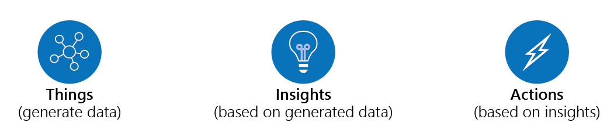
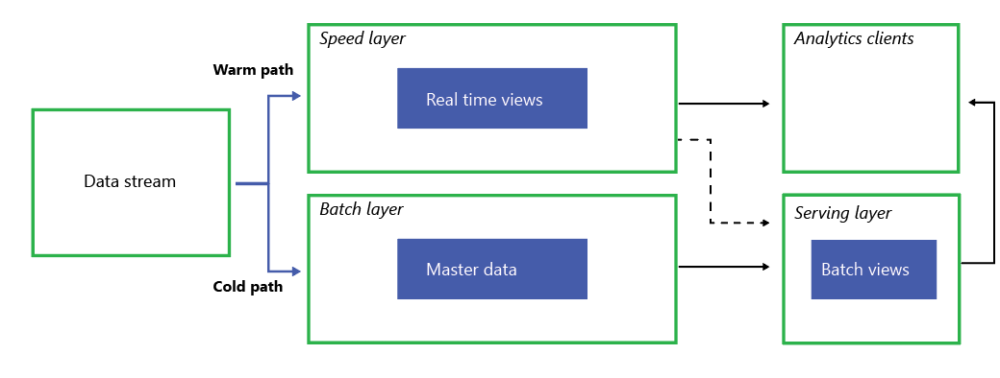

# Extracting Actionable Insights from IoT Data

Manufacturers are looking at a modern factory floor with an eye to improving production and processes using digital tools. And the greatest common denominator is the Internet of Things (IoT). Machines have been emitting data for some time now. New machines will doubtlessly be providing even more data. But having the data is just the first step. Our solution guide provides a path to using the data for actions such as predictive maintenance.

In brief, the solution focuses on three major steps: things (data), insights (via advanced analytics) and actions.

Having data is great, but data is just raw materials.  Insights through analysis guides your actions.  

The architecture is flexible and lets you ingest and analyze data at high throughput. As your needs grow, the components can also scale up and down to meet demand or save cost. The guide also shows you recommendations for implementing the architecture—for example, using Azure Event Hubs to ingest, and Power BI for an analytics client.

