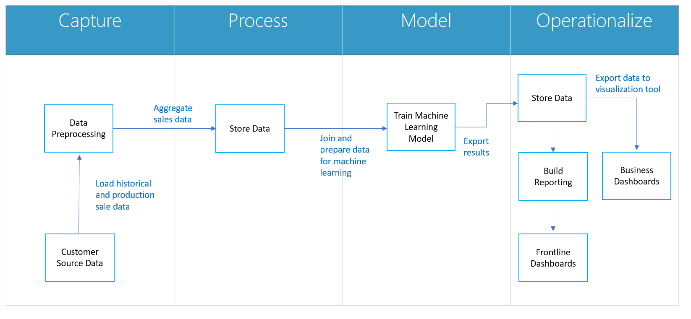
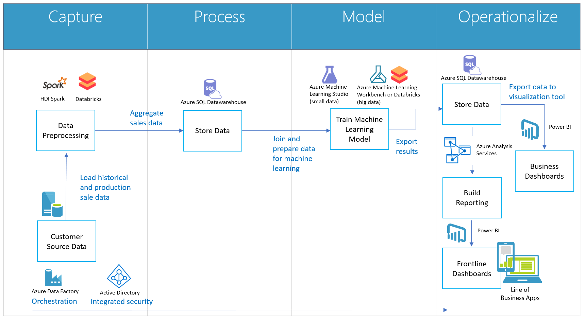
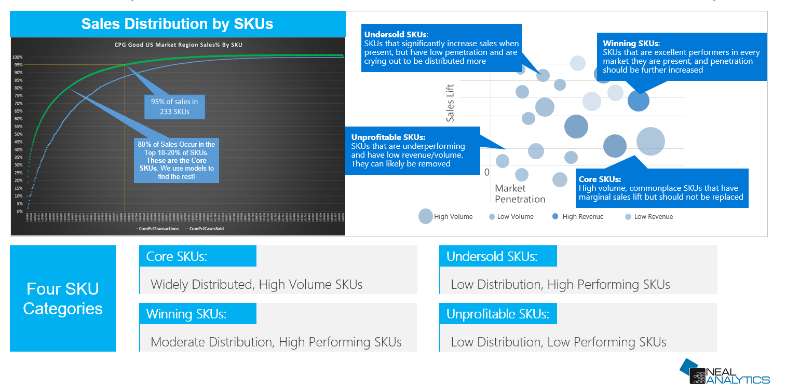
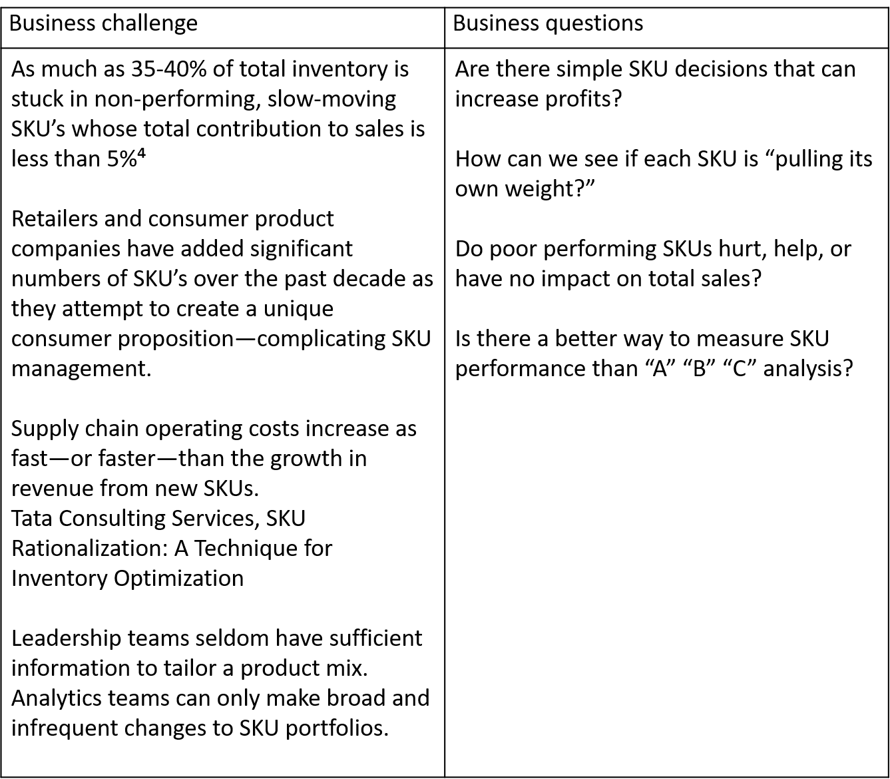

# Solve the out-of-stock problem by optimizing SKU assortment using Azure Machine Learning

SKU Assortment – reduce out-of-stock/switching behavior

## Introduction

A mother with two children in tow (a consumer) walks through a favorite market and scans a shelf for a particular brand of cereal. But she finds that the particular item (SKU) is out. Rather than wait or visit another store, she settles for a competitor’s offering—which is a loss for the brand. This is an out-of-stock scenario, and consumer goods brands want to avoid it because of the loss. One mitigation for this is the idea of SKU assortment optimization. That is, using advanced analytics to more closely monitor, predict, and provide a course of action for an out-of-stock scenario. This paper focuses on how to use Azure to mitigate the effects of out-of-stock scenarios.

The focus on the omnichannel experience and accelerated last-mile fulfillment has cast a light on the value of a well-executed inventory plan to ensure product is available and in stock to purchase. There are many facets to the art and science of merchandising and inventory management that span from product development, sourcing through buy planning, assortment, allocation and movement. Product availability is paramount to any brand’s success, specifically having product stocked on shelves with the right combination of complimentary products. This maximizes sales, delivers a great service experience and drives brand loyalty.

### How being out of stock affects business  
Given the amount of product choices available to a consumer, there is nothing more frustrating when you are looking for a particular brand of product and it is out-of-stock, and unavailable when you need it most. According to [EKR](https://info.microsoft.com/Plugging-Out-of-Stock-Gaps-in-Consumer-Goods.html), when faced with an out-of-stock scenario, only 15 percent of shoppers will delay purchase; there is more likelihood of shifting to a different brand. You lose the sale in that moment, and what’s worse is that if your product is consistently out-of-stock or difficult to access, you open the door for your competitor to win over your customer with their product.  

### Barriers to solutions  
One might think keeping shelves stocked with available product might be an easy task to undertake; however, this is not the case given the scale and often number of SKUs to be managed. Here are some key reasons stock outs are experienced:

- **Imprecise demand forecast accuracy**: Plan assortments for sales channels need accurate demand forecasts. Methodologies tend to be leveraging only historical data and traditional data output with manual manipulation and little visualizations to drive insight and predictive indicators. Today’s demand forecast accuracy stands at 60 percent&#185;.
- **Inaccurate data management**: There are three categories that account for inaccurate data related to stock outs: retailers and brands not systematically capturing data related to stock outs, information that is tracked but not shared across the enterprise, and systems are siloed and unable to share data systematically.  
- **Vague perpetual inventory (PI) data**: PI data leverages POS estimation methods to determine when an item is out-of-stock. The accuracy rate of this data is below 50 percent and provides guidance at a store/outlet level, not at a shelf level&#178;.
- **Inappropriate shelf-space allocation**: Most companies do not use unstructured location-based data sources to identify products which are prone to be out-of-stock. Increasing flexible fulfillment options and shelf-pace for fast moving items adds pressure on inventory accuracy.
- **Low planogram/floor set compliance**: High planogram compliance for fast-selling categories is much needed for optimum retail execution and sell-through. But for low categories, there is a high chance of stock outs given the lack of visibility and breadth of portfolio.
- **People, process and theft problems**: Inventory management, particularly in-store is still a high touch process requiring human intervention. Process and theft impacts for both overstock and stock outs is $705.6 billion&#179; globally.

One of the most pressing issues for solving out-of-stocks is the decreasing margin

SKU assortment optimization  
In this use case, we focus on a consumer goods’ problem of SKU assortment, optimizing available SKUs, and tailoring assortments by store to maximize revenue. We solve for this by developing algorithms for SKU assortment optimization. This is an approach that uses big data analyzed with advanced analytics to create mitigation plans. The partner we focus on, Neal Analytics, uses Azure to create powerful visualizations that support actionable decision making through enhanced insights.  

Questions often asked related to solving out-of-stocks:  

- Which SKUs are performing best in a given market or store?
- Which SKUs should be allocated to a given market or store based on their performance?
- Which SKUs are low performing and should be replaced by higher performing SKUs?
- What other insights can we derive about our consumer and market segments?

Shelf ownership  
The problem of keeping stocks shelved belongs to either the retailer, or to the consumer brand. Both care about keeping stocks shelved. Ultimately, shelf ownership determines who manages SKU assortment optimization. 

## Scenario: food and beverage  
For this use case, we focus on ownership by a consumer goods brand related to food and beverage. A category manager is the primary decision maker, supported and consulted by brand management and product planning. If the retailer owns the shelf, the merchant/category manager may be the primary owner in partnership with the buy planner, who manages demand and financials, and an allocator (in some retail formats), who supports the distribution and flow of inventory. 

It is also important to note the type of merchandise category—hardlines vs. softlines—which may dictate the level at which you will manage assortment; SKU or Style respectively. For example, food and beverage category tends to have many SKUs that are rather persistent over season and time. On the other hand, apparel may have many SKUs to reflect the number of colors and size combinations available. Therefore, style/color level data is more applicable to managing assortment. 

## High-level Solution Description  
The solution must be able to handle millions of SKUs and outlets (customers) by segmenting sales data into peer groups that enable detailed comparisons. The outcome of the solution is the ability to maximize sales at every outlet or store by tuning product assortments using advanced analytics and visualization tools to enable insights. Improved assortment optimization is estimated to result in a 5-10 percent sales increase. Insights result in:

- Understanding SKU portfolio performance and manage low performers
- Optimized distribution of SKUs to reduce out-of-stocks
- Understanding how new SKUs support short-term and long-term strategies
- Creating repeatable, scalable, and actionable insights with data already available

To address this use case, Azure offers several out-of-the-box services that can be used to build a scalable analytics solution, that is cost effective and comprehensive. These services provide industry leading functionalities needed for compute, connectivity, storage, machine learning, reporting and data visualizations in an easy to deploy, repeatable manner that require less custom code to develop.

For the current scenario, Neal Analytics works with a customer to identify a set of data sources particular to the food and beverage business.  **Capture** starts with collecting sales history, customer demographic, and SKU data data across a geography of stores.  The subsequent data **process** involves standardization, aggregation, and storage of data to be used for model training and feature creation.  Once the **model** is trained and the data pipeline is ready for production, the components are read to **operationalize**.  Once the solution is in production, the data used to score the model and the model predictions are captured and stored for dashboarding and reporting.  Users can then use PowerBI to create custom visualizations that give insights that can be acted on. Users can then understand and plan SKU optimization.

Let’s look at the components of an assortment optimization solution (Figure 1). 

  
&nbsp;&nbsp;&nbsp;&nbsp;&nbsp;&nbsp;&nbsp;&nbsp;&nbsp;&nbsp;&nbsp;&nbsp;&nbsp;&nbsp;&nbsp;&nbsp;&nbsp;&nbsp;<i>Figure 1: Assortment Optimization Solution</i>

**Customer Source Data** can be defined as: 
- Sales—transaction, sale price, quantity, transaction location, etc. 
- Outlet (customer)—geography hierarchy, outlet identifiers, date, time, register, etc.
- Product dimension—product hierarchy, SKU, product name, price, cost, etc.

**Data preprocessing** prepares large datasets to be cost-effectively parsed into manageable sets to be leveraged for machine learning models. This can occur on-premises, or directly in the cloud depending upon your requirements and preferences. If in the cloud, data would likely be stored in [Azure Blob Storage](https://azure.microsoft.com/en-us/services/storage/blobs?WT.mc_id=skuassortment-usecaseguide-mazoroto) to be consumed by [Azure Databricks](https://azure.microsoft.com/en-us/services/databricks?WT.mc_id=skuassortment-usecaseguide-mazoroto), or [Azure Machine Learning Workbench](https://docs.microsoft.com/en-us/azure/machine-learning/service/overview-what-is-azure-ml?WT.mc_id=skuassortment-usecaseguide-mazoroto).  At this stage, data integration and aggregation are typically done by time or by product group, and not by customer, to deliver as much insight and detail as possible. Once the datasets are curated, model features are developed using a variety of Platform-as-a-Service (PaaS) offerings such as [HDI Spark](https://azure.microsoft.com/en-us/services/hdinsight?WT.mc_id=skuassortment-usecaseguide-mazoroto) or Azure Databricks. Tools selection is often driven by preference and internal requirements.

**Data is stored** in [Azure SQL Data Warehouse](https://azure.microsoft.com/en-us/services/sql-data-warehouse?WT.mc_id=skuassortment-usecaseguide-mazoroto), and then fed into [Azure Machine Learning services](https://azure.microsoft.com/en-us/services/machine-learning-services?WT.mc_id=skuassortment-usecaseguide-mazoroto), where models are trained, and APIs are published. Azure Machine Learning deploys predictive models into a variety of environments. Models are stored, registered and managed via the Azure cloud. [Azure Data Factory](https://azure.microsoft.com/en-us/services/data-factory?WT.mc_id=skuassortment-usecaseguide-mazoroto) is a cloud data integration service. It lets you compose data storage, movement and processing services into automated data pipelines such as batch scoring and retraining of the models over time.

**Azure Machine Learning Environment** has several options. Azure Machine Learning Studio manages and maintains models more easily through built-in automation and a drag-and-drop user interface. The interface facilitates model development, management and operationalization for any dataset up to 10 GB of data. For larger datasets, or model workloads that require significant compute or scalability, a first-party Azure service like Azure Machine Learning Workbench or Databricks is recommended.

**Reporting and visualization** layers will vary depending upon how the data is accessed, and by whom the data will be used. For a large enterprise that wants to have the data accessible to thousands of frontline employees managing outlet locations, a scalable reporting platform is required to handle identity and mass parallelization. [Azure Analysis Services](https://azure.microsoft.com/en-us/services/analysis-services?WT.mc_id=skuassortment-usecaseguide-mazoroto) is a fully managed PaaS that provides enterprise-grade data models in the cloud. The data models provide an easier and faster way for users to browse massive amounts of data for ad-hoc data analysis via [Power BI](https://powerbi.microsoft.com/en-us?WT.mc_id=skuassortment-usecaseguide-mazoroto). Those enterprises that require access for a smaller user base may leverage SQL Data Warehouse to store data and load data directly to Power BI. PowerBI enables interactive and customized visualizations, reports and dashboards.

**Solution security is provided** via [Azure Active Directory](https://azure.microsoft.com/en-us/services/active-directory?WT.mc_id=skuassortment-usecaseguide-mazoroto). As a general guideline, user identity is provided through Azure Active Directory and reports are shared and managed through PBI workspaces and content packs.  It is integrated with PowerBI and leverages Azure Analyzes when row level security is required.

&nbsp;&nbsp;&nbsp;&nbsp;&nbsp;&nbsp;&nbsp;&nbsp;&nbsp;&nbsp;&nbsp;&nbsp;&nbsp;&nbsp;&nbsp;&nbsp;&nbsp;&nbsp;&nbsp;&nbsp;&nbsp;&nbsp;&nbsp;&nbsp;&nbsp;&nbsp;&nbsp;&nbsp;&nbsp;&nbsp;&nbsp;&nbsp;&nbsp;&nbsp;&nbsp;&nbsp;<i>Figure 2: Assortment Optimization Solution</i>

## Partner Overview  
There are a variety of Microsoft partners that offer SKU Assortment Optimization solutions should you decide not to pursue building the solution internally. Advanced analytics solutions require people with depth in data science and data management to effectively build algorithms, and train and manage models over time. This is in addition to supporting a secure, reliable and performant solution across key activities. Those activities include: data capture, data processing, modeling, and operationalizing insights across an organization. Microsoft partners offer deployable SaaS solutions focused on their core competencies using Microsoft technology services to accelerate competitive differentiation. 

SKU Max Assortment Optimization

Neal Analytics is Microsoft’s 2017 Partner of the Year for Business Analytics. They provide businesses across the globe the ability to derive actionable insights to some of the top business challenges related to managing inventory, customer relationships and business profitability; it helps organizations leverage their data estate to provide predictive and meaningful data.

One of Neal Analytics offerings is [SKU Max](https://nealanalytics.com/solutions/sku-max/), a solution developed while working with top global retail and consumer goods companies, built on Microsoft Azure’s industry-leading suite of analytics and data tooling for rapid time-to-insights. Customers include Arca Continental (a leading beverage manufacturer and distributor in Mexico), Coca-Cola North America, and many other retail and consumer brands. 
Most customers are relying on pivot tables counting SKU sales volumes and rewarding the same products year after year. In contrast, SKU Max compares the assortment of a store to those of its peers and competition in that market to provide optics into performance. This enables individual stores to optimize assortment to the most popular and profitable products, maximizing sales. 

It is also common for stores to sell the vast majority of volume from relatively few SKUs. Typically, the assortment offered continues to grow, without any reliable metric to justify product removal. Without managing assortment, there is an increased risk of out-of-stocks for the most profitable products. This is especially harmful given the valuable shelf real estate that is shared with slow moving products. And many such products languish until they are ultimately discounted or returned. This directly impacts margins and slows turn. 

Neal Analytics has long established itself as a leader in the space of data science and AI. From building semi-supervised regressions to predict the prices of used cars to predicting and explaining the key drivers of whether a customer will file their taxes online or in a store, they are experts at tuning algorithms for unique datasets and business use cases. Where others will push data of questionable quality and relevance into a model,they engineer and test hundreds of potential features and iteratively develop algorithms side by side with their client’s SMEs for real time feedback and guidance. This results in a model that is not only more accurate,but aligns with the rules and logic of the client’s business. 

Neal Analytics suggests that SKUs will fall into one of four categories:  

- **Core SKUs** are those that provide the most sales volume and, when summed up, meet 80% of the demand. 
- **Winning SKUs** are well distributed and sell significant volume, but also significantly increase store sales when present over those that do not carry them. 
- **Undersold SKUs** are the diamonds in the rough. Such SKUs, though not well proven through wide distribution and significant volume sold, are promising from their observed impact in raising store sales when they are present. 
- **Unprofitable SKUs** are essentially the inverse. They are also low in volume and distribution, but either do not significantly impact sales, or actually decrease sales over stores that don’t carry them (cannibal SKUs).

&nbsp;&nbsp;&nbsp;&nbsp;&nbsp;&nbsp;&nbsp;&nbsp;&nbsp;&nbsp;&nbsp;&nbsp;&nbsp;&nbsp;&nbsp;&nbsp;&nbsp;&nbsp;&nbsp;&nbsp;&nbsp;&nbsp;&nbsp;&nbsp;&nbsp;<i>Figure 2: SKU Classification</i>

Because a SKU might be designated a certain category in one market but not in another, SKU Max helps category managers, product planners, and field sellers understand where a SKU is crucial and where it is not. Therefore all of these result in substantial impacts on the bottom line: optimizing distribution, inventory allocation, facings needed, and even production. 

SKU Max addresses the following business challenges and questions:

SKU Max solution:  

- Identifies top and bottom performing SKUs.
- Provides appropriate grouping of or core SKUs to maximize sales based on store location.
- Enables dynamic SKU portfolio management: incremental adjustments to individual assortments can be made at a granular level. If a SKU is underperforming in a particular outlet or market, you can take action before significant loss occurs. Similarly, if you have an overperforming SKU, you can take action based on the data.
- Delivers customizable business logic and other operational considerations per customer.

As a Neal Analytics core offering, SKU Max is backed by end-to-end data consulting services and industry leading data science/advanced analytics experience. It also has the advantage of being built on Microsoft’s cutting-edge cloud technology platform. Regardless of the current data or analytics maturity, Neal Analytics can build a tailored path to digital maturity, while providing incremental wins with deployments of SKU Max and other Retail IQ platform solutions. Household names around the world trust Neal Analytics to guide their digital strategy and solve their most challenging problems. And they deliver data solutions with the empathy needed to truly understand what will drive the most value for customers. 

Customer Quotes:  
“When we started with this project, we were searching for new and improved ways to serve our clients and consumers while booting profitability. We needed to better use the data we already had and gain a more comprehensive understanding of sales variations and correlations between multiple variables.”

_Lizeth Refugio Salas, Revenue Growth Management Chief, Arca Continental_

“The first project was about marketing. But there are other areas we want to pursue, like production, logistics,and warehousing. We can use Azure ML to generate answers for each individual area and get combined answers for the entire company.”

_Ruben Dario Torres Matinez, IT Manager, Arca Continental_

## Conclusion

Out-of-stocks account for an estimated $129.5 billion annual loss for North America&#8309;.  Combined with overstocks which suffer from the same rooted problems of inaccurate data management, error-prone processes, and siloed information, the cost climbs into the trillions of dollars lost globally. With the security and economic benefits provided by the cloud and other transformational technologies (such as AI being accessible to all), there is real opportunity to make significant headway to address inventory challenges like out-of-stocks. As consumers’ expectations evolve rapidly to include real-time engagement, and get-it-now expectations, SKU optimization should be a top-of-mind topic to be addressed. The good news is that much of the data to support this type of analysis is already within your organization. I just needs to be unlocked with expertise and modern data-science capabilities. 

### Next Steps

Visit Microsoft Appsource to test drive the [Neal Analytics SKU Max solution](https://appsource.microsoft.com/en-us/product/web-apps/neal_analytics.8066ad01-1e61-40cd-bd33-9b86c65fa73a?WT.mc_id=social-linkedin-mazoroto) 

To consider development of a SKU assortment solution leveraging Azure refer to X Solution Guide.
(Architects deliverable)

Hear directly from Neal Analytics leadership and their approach to solving stock outs and improving business optics. 
(Podcast)

 

&#185;EKN and Microsoft, [Plugging out-of-stock gaps in consumer goods](https://cloudblogs.microsoft.com/industry-blog/industry/retail/managing-inventory-and-the-out-of-stock-challenge/)  
&#178;Study by GMA, FMI, NACDS, [Comprehensive guide to retail out-of-stock reduction](http://www.nacds.org/pdfs/membership/out_of_stock.pdf)  
&#179;Retailwire, [Retailers suffer the high cost of overstocks and out-of-stocks](https://www.retailwire.com/discussion/retailers-suffer-the-high-cost-of-overstocks-and-out-of-stocks/)  
&#8308;Tata Consulting Services, SKU Rationalization: A Technique for Inventory Optimization  
&#8309;Retailwire, Retailers suffer the high cost of overstocks and out-of-stocks

